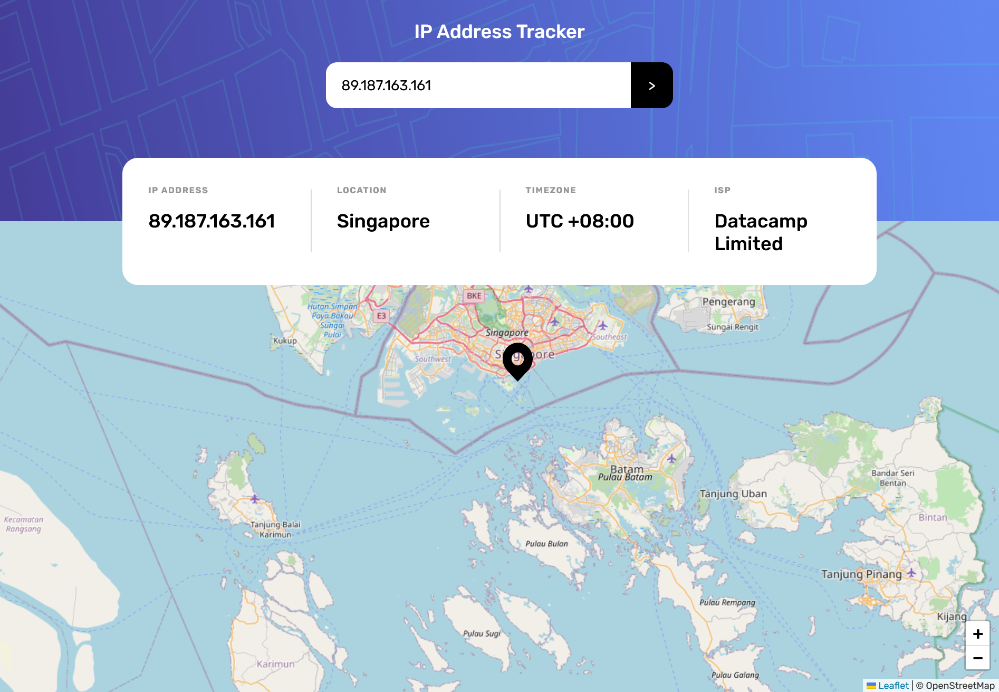

# Frontend Mentor - IP address tracker solution

This is a solution to the [IP address tracker challenge on Frontend Mentor](https://www.frontendmentor.io/challenges/ip-address-tracker-I8-0yYAH0). Frontend Mentor challenges help you improve your coding skills by building realistic projects. 

## Table of contents

- [Overview](#overview)
  - [The challenge](#the-challenge)
  - [Screenshot](#screenshot)
  - [Links](#links)
- [My process](#my-process)
  - [Built with](#built-with)
  - [What I learned](#what-i-learned)
  - [Useful resources](#useful-resources)
- [Author](#author)

## Overview

### The challenge

Users should be able to:

- View the optimal layout for each page depending on their device's screen size
- See hover states for all interactive elements on the page
- See their own IP address on the map on the initial page load
- Search for any IP addresses or domains and see the key information and location

### Screenshot

### Links

- Live Site URL: [https://naanaaabdelmalek.github.io/IP-address-tracker/](https://naanaaabdelmalek.github.io/IP-address-tracker/)

## My process

### Built with

- Semantic HTML5 markup
- CSS custom properties
- Flexbox
- Mobile-first workflow
- IP Geolocation API by IPify 
- LeafletJS (JavaScript library)

### What I learned

In this project i learnt how to use fetch method to make a server request and works with API in javascript, 
rendring the data that i got from the fetch request by manipulating the DOM and changing its value, and it was a great opportunity to learn how to create interactive maps using LeafletJS which is a JavaScript library for mobile-friendly interactive maps. 
  
### Useful resources

- [MDN Web Docs](https://developer.mozilla.org/en-US/docs/Web) - This is Mozilla Developer Network which i usualy use as my web development documentation.
- [IP Geolocation API documentation](https://geo.ipify.org/docs) - This helped me to use and adjust IP Geolocation API.
- [Leaflet API reference](https://leafletjs.com/reference.html) - This reference reflects Leaflet. 

## Author

- Github - [Naanaa Abdelmalek](https://github.com/NaanaaAbdelmalek)
- Frontend Mentor - [@Geekmalek](https://www.frontendmentor.io/profile/Geekmalek)
- Linkedin - [Naanaa Abdelmalek](https://www.linkedin.com/in/naanaaabdelmalek/)

